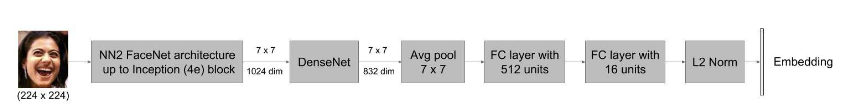

# A Compact Embedding for Facial Expression  
- [A_Compact_Embedding_for_Facial_Expression_Similarity](http://openaccess.thecvf.com/content_CVPR_2019/papers/Vemulapalli_A_Compact_Embedding_for_Facial_Expression_Similarity_CVPR_2019_paper.pdf)(CVPR2019) 



## Note!
We find that densenet block is not import for Model. you can easily replace it with Conv3*3  
Our model structure is the same as [maskrcnn-benchmark](https://github.com/facebookresearch/maskrcnn-benchmark)  
## Prerequisites
- PyTorch 1.0
  - `pip3 install torch torchvision`
- Easydict
  - `pip3 install easydict`
- [Apex](https://nvidia.github.io/apex/index.html)
- Ninja
  - `sudo apt-get install ninja-build`
- tqdm
  - `pip3 install tqdm`  
  

## Model Zoo
### Supported Model
- ResNet18
- Inception N22
- Inception Resnet 
## Datasets
Be Careful! Our model does not use all the triple pairs because of the loss of crawler data. In addition, we use our own align model. If you need our processed data, please email me qiulingteng@stu.hit.edu.cn. 
- [Triple Dataset](https://ai.google/tools/datasets/google-facial-expression/)
## File Structure
```
 `-- PROJECT_ROOT
  -- Triple Dataset
     `|-- train_align
      |-- annotations
```
## Link
we must build the env for training 
```bash
make link
```
soft link to result

## Training
1. create the config file of dataset:`train_list.txt`   
2. modify the `config/*.yaml` according to your requirements

### Distributed Training
We use the official `torch.distributed.launch` in order to launch multi-gpu training. This utility function from PyTorch spawns as many Python processes as the number of GPUs we want to use, and each Python process will only use a single GPU.

For each experiment, you can just run this script:
```bash
export NGPUS=8
python -m torch.distributed.launch --nproc_per_node=$NGPUS train.py
```

### Non-distributed Training
The above performance are all conducted based on the non-distributed training.
For each experiment, you can just run this script:
```bash
bash train.sh
```

In train.sh, the argument of `d` means the GPU you want to use.

## Inference
In the evaluator, we have implemented the multi-gpu inference base on the multi-process. In the inference phase, the function will spawns as many Python processes as the number of GPUs we want to use, and each Python process will handle a subset of the whole evaluation dataset on a single GPU.
1. input arguments in shell:
    ```bash
    bash inference.sh
    ```
## Experiment Results
Backbone | ONE_CLASS ACC | TWO_CLASS ACC | THREE_CLASS ACC| ACC
:--:|:--:|:--:|:--:|:--:
 InceptionNN2+denseblock  | 76.4 | 78.8 | 77.8 | 77.3
 InceptionResnet+denseblock   | 64.1 | 70.0 | 65.2  | 66.9 
 Resnet18+Conv3*3   | 78.2 | 80.5 | 80.2 | 79.7
